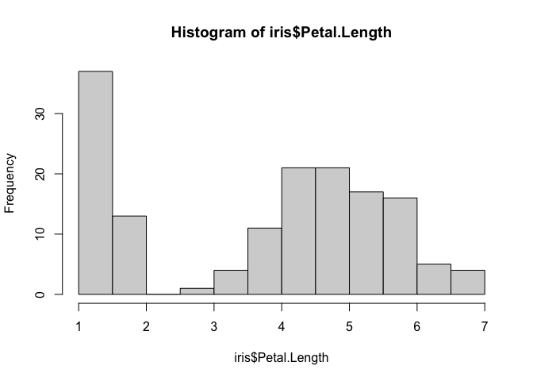

intro_rmarkdown
================
Joe Morris
2022-07-28

``` r
iris[0:10,]
```

    ##    Sepal.Length Sepal.Width Petal.Length Petal.Width Species
    ## 1           5.1         3.5          1.4         0.2  setosa
    ## 2           4.9         3.0          1.4         0.2  setosa
    ## 3           4.7         3.2          1.3         0.2  setosa
    ## 4           4.6         3.1          1.5         0.2  setosa
    ## 5           5.0         3.6          1.4         0.2  setosa
    ## 6           5.4         3.9          1.7         0.4  setosa
    ## 7           4.6         3.4          1.4         0.3  setosa
    ## 8           5.0         3.4          1.5         0.2  setosa
    ## 9           4.4         2.9          1.4         0.2  setosa
    ## 10          4.9         3.1          1.5         0.1  setosa

``` r
hist(iris$Petal.Length)
```

<!-- -->
